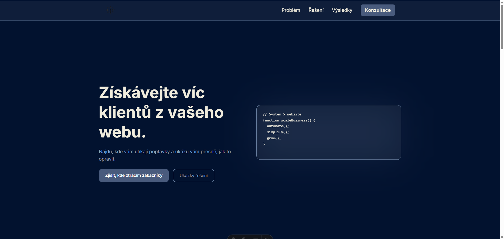

# 🚀 Mikulenka.dev – Konverzní web

Web zaměřený na jediný cíl:
👉 přivádět klienty skrze jednoduchý a funkční systém

---

## ✨ Co řeší

Většina webů:

* má návštěvnost, ale nepřináší poptávky
* je složitá a roztříštěná
* nevede uživatele k akci

Tenhle projekt ukazuje opačný přístup:
👉 minimalismus + jasná struktura + konverze

---

## 🧠 Přístup

* 1 jasný cíl → získat klienta
* žádný vizuální chaos
* každá sekce vede k akci
* žádné zbytečné technologie

---

## 🛠️ Stack

* Astro
* Tailwind CSS
* Deploy: (doplň – Vercel / Netlify / Railway)

---

## 📸 Screenshot



---

## ⚙️ Lokální spuštění

```bash
npm install
npm run dev
```

---

## 📦 Build

```bash
npm run build
npm run preview
```

---

## 🎯 Poznámka

Tento projekt není o designu.
Je o tom, aby web **vydělával**.

---

## 📬 Kontakt

Chceš podobný systém?
👉 <https://calendly.com/pilsenhorn/audit-systemu-30-min>
